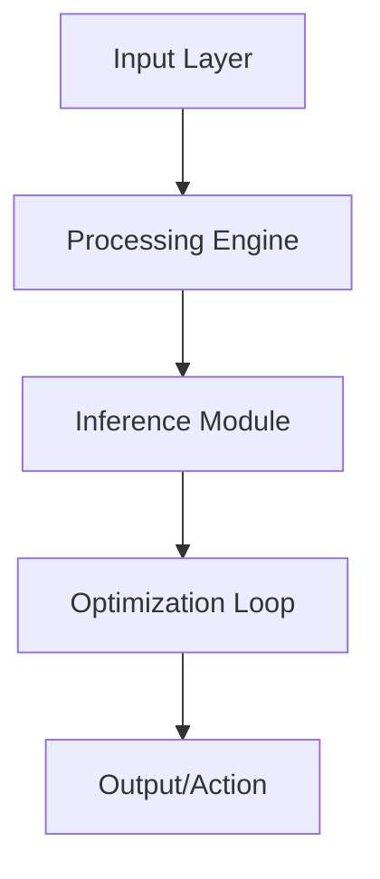

# 🤖 Physics AI Simulation

[](LICENSE)
[](https://www.python.org/)
[](#)

AI-driven physics simulation using Physics-Informed Neural Networks (PINNs).

## 🏗️ Architecture



## 🌟 Key Features
- **PINNs Solver**
- **Real-time Fluid Dynamics Simulation**
- **Boundary Condition Optimization**

## 🛠️ Technology Stack
- `PyTorch`
- `JAX`
- `SciPy`
- `Matplotlib`

## 🚀 Installation

```bash
git clone https://github.com/YannLeCun25/physics-ai-sim.git
cd physics-ai-sim
pip install -r requirements.txt
```

## 📂 Project Structure
```
├── src/            # Modular source code
├── tests/          # Unit & integration tests
├── docs/           # Technical documentation
├── requirements.txt # Dependency list
└── setup.py        # Package installation
```

Developed by **Yann LeCun** (Elite AI Engineer).
